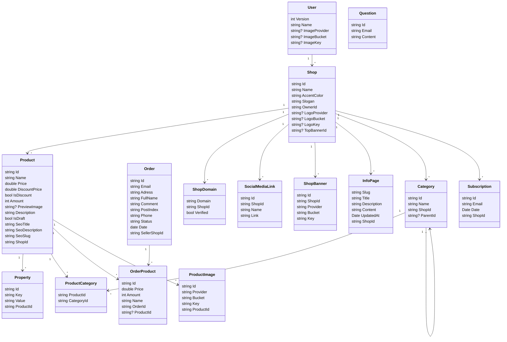

```mermaid
classDiagram

  Category "1" --> "*" ProductCategory
  Category "1" --> "*" Category

  Order "1" --> "*" OrderProduct

  Shop "1" --> "*" Product
  Shop "1" --> "*" ShopDomain
  Shop "1" --> "*" SocialMediaLink
  Shop "1" --> "*" ShopBanner
  Shop "1" --> "*" InfoPage
  Shop "1" --> "*" Category
  Shop "1" --> "*" Subscription

  User "1" --> "*" Shop

  Product "1" --> "*" Property
  Product "1" --> "*" ProductCategory
  Product "1" --> "*" OrderProduct
  Product "1" --> "*" ProductImage

  class Category {
    string Id
    string Name
    string ShopId
    string? ParentId
  }
  class Order {
    string Id
    string Email
    string Adress
    string FullName
    string Comment
    string PostIndex
    string Phone

    string Status
    date Date
    string SellerShopId
  }
  class OrderProduct {
    string Id
    double Price
    int Amount
    string Name
    string OrderId
    string? ProductId
  }
  class Product {
    string Id
    string Name
    double Price
    double DiscountPrice
    bool IsDiscount
    int Amount
    string? PreviewImage
    string Description
    bool IsDraft
    string SeoTitle
    string SeoDescription
    string SeoSlug
    string ShopId
  }
  class ProductCategory {
    string ProductId
    string CategoryId
  }
  class ProductImage {
    string Id
    string Provider
    string Bucket
    string Key
    string ProductId
  }
  class Property {
    string Id
    string Key
    string Value
    string ProductId
  }
  class InfoPage {
    string Slug
    string Title
    string Description
    string Content
    Date UpdatedAt
    string ShopId
  }
  class Shop {
    string Id
    string Name
    string AccentColor
    string Slogan
    string OwnerId

    string? LogoProvider
    string? LogoBucket
    string? LogoKey
    string? TopBannerId
  }
  class ShopBanner {
    string Id
    string ShopId

    string Provider
    string Bucket
    string Key
  }
  class ShopDomain {
    string Domain
    string ShopId
    bool Verified
  }
  class SocialMediaLink {
    string Id
    string ShopId

    string Name
    string Link
  }
  class Subscription {
    string Id
    string Email
    Date Date
    string ShopId
  }
  class Question {
    string Id
    string Email
    string Content
  }
  class User {
    int Version
    string Name

    string? ImageProvider
    string? ImageBucket
    string? ImageKey
  }
```
