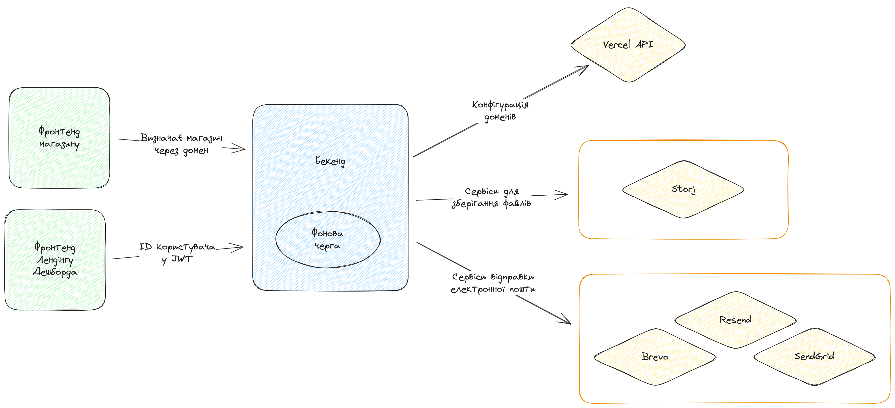

# Презентація

Порядок:

- Виталій - спільне
- Роман - архітектура
- Марія - лендінг
- Виталик - авторизація
- Мария - дешборд
- Виталик - дешборд приколи
- Дима - магазин

## Вступ

...дизайнери

## Про нас

Вітання! Мене звуть Кощей Роман, студент групи ПВ012. Я Team Lead розробників та Project Manager усього продукту.

Вітаю! Мене звати Литвиненко Віталій, студент групи ПВ012. Я основний Full-stack розробник, у проекті відповідаю за взаємодію між сервером та клієнтом та інспектую баги.

Добрий день! Мене звуть Марічка, студентка групи ПВ012. Я Full-stack розробникз ухилом у фронтенд анімацію та адаптивну верстку.

Добрий день! Мене звуть Флюд Дмитрик, студент групи ПВ012. Я Full-stack розробник, пишу багато боілерплейт коду.

## Віталій - тема, цілі

Тема проекту Spentoday:

Щоб зрозуміти потреби наших користувачів, ми провели ретельне дослідження та аналіз ринку, вивчаючи подібні проекти. Висновок виявився очевидним: на українському ринку бракує зручного інструменту для легкого створення власного інтернет-магазину.

Spentoday - це сервіс для швидкого та зрозумілого запуску власних онлайн-магазинів в Україні.

Цілі нашого проекту:

- Задовольнити попит на ринку України інструмента для легкого створення власного інтернет-магазину.
- Надати кінцевим користувачам можливість швидко та зручно розгортати свій онлайн-бізнес, зберігаючи при цьому для них простоту та зрозумілість функціоналу.
- Забезпечити приємний та ефективний досвід користувачам під час використання сервісу, відповідаючи потребам підприємців та творчих особистостей у сфері електронної комерції.
- Реалізувати MVP протягом 3 місяців.

## Роман - комунікація в команді

Щодо організації роботи в команді, то ми використовуємо GitHub для **відслідковування** завдань
як для дизайнерів так й для розробників.
Для виправлення невеликих полимок ми комунікуємо на пряму до того, хто працював над цією частиною проекту.

Наприклад, якщо дизайнери знайшли якісь розбіжності або помилки в лендінгу,
то вони напряму звертаються до розробників і ті швидко все лагодять без відкривання таски.
Такий метод запобігає зайвих витрат часу та швидкі ітерації.

Серед розробників ми віддаємо перевагу розподілу завдань за функціоналом, а не за областями відповідальності. У нас немає чіткого розподілу за спеціалізацією, адже кожен з нас - Full-stack розробник.
Наприклад, якщо є завдання створити замовлення, то один розробник виконує функціонал для замовлень на бекенді, цей же розробник робить фронтенд у магазині для замовлень.
Це дозволило нам уникнути затримок у виконанні завдань та конфліктів у коді. Якщо щось потрібно виправити, кожен може взяти на себе ініціативу, незалежно від області його спеціалізації.

Далі Анастасія розкаже нам про етапи роботи дизайнерів.

...дизайнери

## Віталік - Спільне

### Технології та Архітектура Веб-сервіса проекту Spentoday

Дякую Анастасіє

У розробці проекту Spentoday були використані передові технології та практики для створення високоефективного веб-сервісу для розгортання та запуску інтернет-магазинів. Давайте розглянемо деякі з них.

1. Мови програмування та фреймворки:

- Для розробки бекенду використовується C# - потужна та надійна мова програмування від Microsoft.

- ASP.NET Core - Основний фреймворк для створення веб-додатків та API. Він забезпечує високу продуктивність і безпеку.

- Для фронтенду використовуються TypeScript та Svelte/SvelteKit - технології, які дозволяють створювати швидкі та інтерактивні користувацькі інтерфейси.

- Tailwind CSS використовується для ефективної стилізації та оформлення дизайну. Надає простоту та гнучкість у роботі зі стилями.

2. База даних:

- Для взаємодії з базою даних використовується PostgreSQL для зберігання даних інтернет-магазинів. Ця система керування базами даних надійна, швидка та масштабована.

3. Архітектура:

- Сервіс Spentoday побудований на основі многорівневої монолітної архітектури, що дозволяє логічно розділити функціонал проекту на різні рівні та модулі, забезпечуючи високий рівень організації коду та підтримки.

- Для розгортання використовуються платформи Fly.io та Vercel, що дозволяють автоматизовано розгортати та керувати сервісами в хмарному середовищі.

4. Розсилка інформації:

- Для розсилки електронних листів використовуються сервіси Resend та SendGrid, що допомагають надійно та ефективно спілкуватися з користувачами.

Ці технології та архітектурні підходи дозволили нам створити надійний та швидкий веб-сервіс Spentoday для розгортання інтернет-магазинів, надаючи користувачам можливість легко розпочати свій онлайн-бізнес.

Детальніше про архітектуру далі розповість тімлід проекту Роман.

---

## Роман - Архітектура

Як тімлід та провідний розробник, я розповім про загальну архітектуру та структуру нашого проекту.

На початку, дозвольте представити загальну картину взаємодії компонентів проекту за допомогою цієї схеми [показую схему].

У нас є два фронтенда.
Головний, який розташований за адресою spentoday.com, містить лендінг та дешборд. Він взаємодіє з бекендом для управління магазинами.
Другий - це фронтенд магазину, який має багато доменів для різних магазинів. Бекенд, знаходячи потрібний магазин за допомогою домену, завантажує відповідний контент, такий як продукти та інформаційні сторінки.

Наступним елементом є бекенд з фоновою чергою для виконання завдань незалежно від запитів. Важливо відзначити, що бекенд використовує API Vercel для конфігурації доменів для магазину.

Ми також розробили архітектуру, яка дозволяє використовувати декілька сервісів для відправки електронної пошти та зберігання файлів. Це підвищує стабільність, оскільки у нас є можливість переключатися між сервісами у випадку проблеми з одним із них без змін коду, а також дозволяє ефективніше використовувати ресурси.

Функціонал почнемо переглядати з головного фронтенду, а саме лендінгу. Передаю слово Марічці.

## Марія - Лендінг

Сьогодні я представлю лендінг нашого проекту.

В розділі "Про нас" представлено промо-відео нашого проекту. У розділі "Процес роботи" ви можете переглянути три відео-інструкції щодо відкриття свого магазину на нашій платформі. У блоку "Технології" ми описали переваги технологій та мов, які ми використовуємо.

У майбутньому на нашій платформі можна буде обрати один із трьох видів підписок: "Хобі" (безкоштовний), "Про" (акаунт для невеликих магазинів), та "Бізнес" (для великих магазинів з необмеженою кількістю ресурсів).

Якщо у вас залишилися питання, ви можете надіслати їх через форму зворотного зв'язку.

Далі я передаю слово Віталію, який ознайомить вас з системою логіну сервісу.

## Віталік - Авторизація

Зараз я хочу поділитися з вами деталями у розробці системи реєстрації та авторизації в нашому проекті Spentoday. Цей аспект важливий, оскільки він визначає не лише безпеку користувачів, але й комфорт їхньої взаємодії з нашим сервісом.

Під час розробки авторизаційної системи на бекенді, ми використовуємо потужний та надійний фреймворк ASP.NET Identity. Цей фреймворк надає нам гнучкість та розширюваність для впровадження різних видів авторизації.
Зокрема, ми використовуємо JWT (JSON Web Token) для гарантії безпеки ідентифікації користувачів. Це рішення дозволяє нам ефективно керувати сесіями користувачів та надійно захищати їхні дані.

Однією з ключових переваг такого рішення є можливість безпечного входу без повторного надання логіну та паролю. Після успішної авторизації користувач отримує токен, який зберігається у вигляді куків у браузері. Це дозволяє автоматично входити в систему при подальших відвідуваннях без додаткового введення даних.
Токени додатково захищені шляхом підпису та шифрування, що гарантує їхню цілісність та конфіденційність.

Процес реєстрації в Spentoday включає відправку підтверджувального листа на вказану користувачем електронну пошту. Цей механізм гарантує, що ми спільно з користувачем переконуємося в правомірності його облікового запису.
Після реєстрації, на електронну пошту користувача надсилається лист із унікальним посиланням для підтвердження облікового запису.

В усьому цьому рішенні, наша команда об'єднала сучасні технології та передові практики, щоб гарантувати безпечний та комфортний досвід для наших користувачів. Система реєстрації та авторизації в Spentoday – це лише один із прикладів того, як ми прагнемо до високих стандартів у розробці та затвердженні інтернет-безпеки.

Далі передаю слово Марії, яка представить дешборд проекту.

## Марія - дешборд

Одразу ми потрапляємо на головну сторінку, на якій ви можете побачити всі свої магазини та створити нові. З цієї сторінки є можливість перейти на редагування свого профілю для зміни імені, пароля, видалення акаунта або виходу з нього.

При переході на конкретний магазин ми відразу бачимо список усіх товарів. Вони поділяються на два статуси: активні та чернетки. При створенні нового товару, продукту автоматично присвоюється статус "чернетка". Ви можете змінити його під час редагування продукту, а також внести зміни до назви, ціни, акційних пропозицій, опису, характеристик, медіа та категорії товару.

У розділі "замовлення" знаходяться всі замовлення, які були зроблені у вашому магазині, разом із їх вартістю, статусом та датою створення.

У розділі "підписки" ви знайдете адреси електронної пошти всіх ваших підписників.

У розділі "категорії" ви знайдете всі категорії магазину та матимете можлисть додавати нові. За замовчуванням, категорія стає батьківською, але ви можете зробити її підкатегорією вже існуючої.

У розділі "домени" ви можете додати додатковий домен для свого магазину або використовувати один безкоштовний.Для активації кастомного домену, потрібно
скопіювати DNS значення з нашого сайту та додати до придбаного домену.

У розділі "налаштувань" ви можете змінити назву магазину, вибрати акцентний колір, додати гасло, яке буде відображатися на головній сторінці магазину, завантажити медіа дані та логотип.

Передаю слово Віталію, який розповість вам про особливості редактору інформаційних сторінок.

## Віталік - редактор

Далі я б хотів розповісти вам про свій власний досвід у розробці MarkDown редактора в межах проекту Spentoday. Цей елемент став важливою складовою нашого проекту, дозволяючи користувачам комфортно та ефективно форматувати інформаційні сторінки своїх магазинів.

Спочатку ми розглядали можливість використання готової реалізації MarkDown редактора, яка легко інтегрується в наш код. Здавалося, що це може значно скоротити час розробки та спростити нашу задачу.
Проте, після детального аналізу різних варіантів, ми прийшли до висновку, що жодне з готових рішень не повністю відповідає нашим вимогам. Багато з них були важкими для налаштування, не мали необхідного рівня гнучкості або просто не відповідали дизайну та вимогам нашого проекту.

Після обговорення та аналізу варіантів, ми прийняли рішення – розробити свій власний MarkDown редактор. Це виявилось не тільки високою, але й захоплюючою задачею для нашої команди.
За основу та як прототип було взято MD редактор GitHub.

Однією з ключових переваг нашого власного MarkDown редактора стала його гнучкість. Ми врахували вимоги нашого проекту та потреби користувачів, додавши функціонал, який необхідний саме нам.
Важливою складовою було інтегрування редактора з іншими частинами нашого проекту. Ми врахували це в процесі розробки, забезпечуючи зручну взаємодію та спільну роботу з іншими компонентами.

Розуміючи, що не всі користувачі мають глибоке знання цього формату, ми також додали спеціальні спливаючі блоки-підказки, щоб у них не було зайвої потреби шукати інформацію на інших ресурсах.
Ці інформаційні блоки надають швидку довідку щодо основних елементів MarkDown. Тут ви знайдете приклади створення заголовків, списків, вставки зображень та багато іншого.
Тепер, коли ви використовуєте синтаксис MarkDown, ви можете спостерігати за змінами в реальному часі. Результат з'являється поруч з редактором, що допомагає вам візуалізувати, як ваш текст буде виглядати на кінцевій сторінці.
У підсумку, наш досвід у розробці MarkDown редактора підкреслює важливість гнучкості та індивідуального підходу у вирішенні завдань. Ми віримо, що це власне рішення внесе значний вклад у впровадження комфортного та функціонального інструменту для роботи з текстом у рамках нашого проекту Spentoday.

Тепер перейдемо безпосередньо до магазину. Його вам буде презентувати Дмитро.

## Дімон - Магазин

Магазин - це одна з основних структурно-важливих та функціональних одиниць нашого проекту.
На головній сторінці мы бачимо банер сайту, а нижче розташовуються популярні продукти та категорії які користуються попитом в магазині.
Далі розглянемо каталог, в якому, завдяки динамічній фільтрації та зручному дизайну, ви зможете швидко реалізовувати пошук за ціною, назвою або категорією, також, ви маєте змогу сортувати товари за новинками, від дешевших до дорожчих та навпаки.  
Перейшовши на сторінку обраного продукту ви можете більше дізнатись про нього, його характеристики, і потім додати його до кошику обравши перед тим потрібну кількість товару.
У самому кошику, який є локальним, ви можете регулювати кількість товарів або самі товари та замовити обране.
Потрапивши на сторінку замовлення ви маєте змогу керувати товарами та побачити суму вашого замовлення, для того щоб замовити вам потрібно заповнити форму з контактною інформацією у вигляді вашого повного імені імейлу та номеру телефону, а потім вказати деталі доставки, ввівши вашу адресу, поштовий індекс та коментар з питанням, проханням або з уточнюючою інформацією. Після закінчення оформлення замовлення вам буде надіслано імейл з його деталями та контактною інформацією продавця.
Також перейшовши по кнопці «Про нас» ви можете перейти на інформаційні сторінки, де власник магазину розміщує інформацію про оплату, політику конфіденційності або якусь іншу інформацію про ону крамницю.

Тепер ви маєте змогу спробувати наш продукт за посиланням, що зараз на екрані.
Нагадую що Spentoday є open-source проектом, тож ви можете ознайомитись з його кодовою базою на гіт хабі нашого агенства по розробці Flurium. Далі передаю слово дизайнерам.
